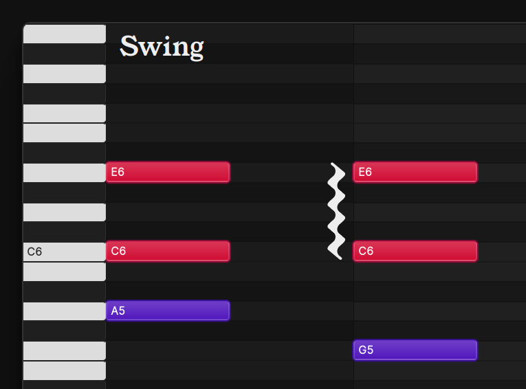

# Your new digital atelier

Overtone is a music composition app. While it does have the capabilities of a Digital Audio Workstation,
its primary focus to empower the iterative creativity of making music by "messing around" on your computer.

The primary focus of this program is to be clear, intuitive, modular, with a low entry bar and a fun learning curve. 

## Features

### Semantic Notation

In addition to supporting MIDI, Overtone supports [MUS](./reference/mus), a **new** format for storing and exchanging musical data
The highlight of this format is the first-class support for musical notation, which affects playback.

With a standard way to mark articulations, ornaments, etc, every instrument can be compatible with each other.

### Production Setups

Overtone has a graph-based system where you can create prodution setups. 
Rendering music with synths or sample libraries, applying effects on audio, recording and then outputting to audio devices.

Production Setups are important for exporting, recording, live performances...

### Bring your plugins!

Overtone supports `SoundFont 2.0`, `LV2` and `VST`, and, therefore, a giant library of instruments and plugins.

### Keep it tidy!

See all your songs, WIPs and audio files, in one place. Filter, search, bulk-edit their metadata, create albums and collections.

### Own it!

Files are all stored locally, many in plain text, and so no vendor-lock in. The editor is free and requires no login.
Once you download it, it's yours forever.

## And now, Get Started!

[Begin your music making journey](./guides/getting_started) now! Come on! Go go go!