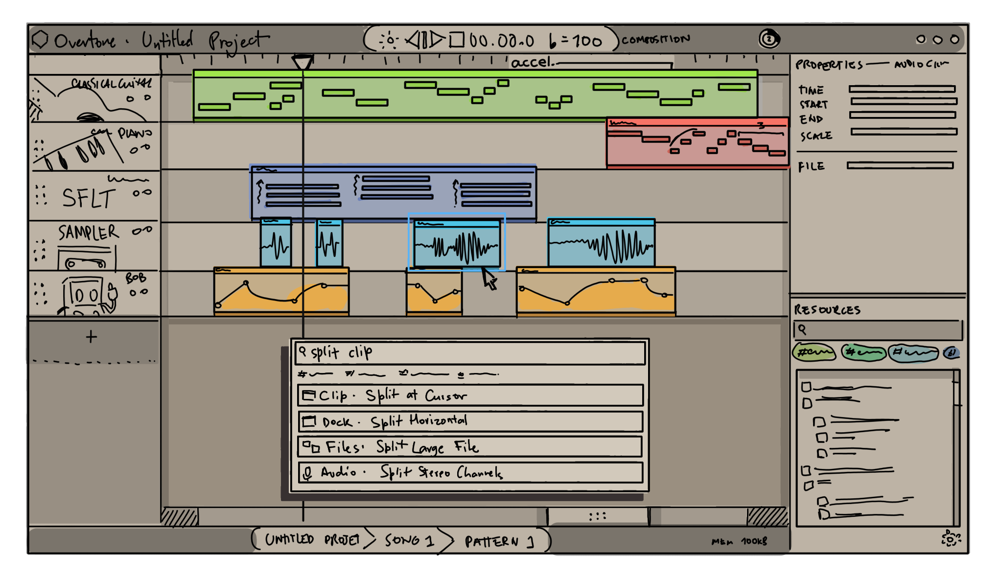

# Compositions

A composition combines musical data, audio samples, lyrics and who knows what else to create something that can be exported as, usually, audio.

## Editing a Composition

The GUI editor has many UIs for editing different kinds of data.

### Standard Multi Tracks Editor

Allows you to arrange several elements across time by panning, stretching, trimming and cutting them (non-destructively);
You can also arrange them vertically on separate tracks, each which may be assigned [an instrument](/reference/Instruments).

### Standard Music Editor (The Piano Roll)

An editor for MUSx elements, allowing you to edit the notes, add notation,
and visualize the music in different ways.

### Standard Audio Sampler

An editor for audio samples.

## Generators (Instruments)

Generators render your composition, so that it can be exported into
`.wav`, `.mp3`, `.lrc`, etc., or played into the speakers.

Of course, instead of just rendering the composition and exporting as-is
you might want to post-process your audio by apply effects. This is what
Production Setups are for.