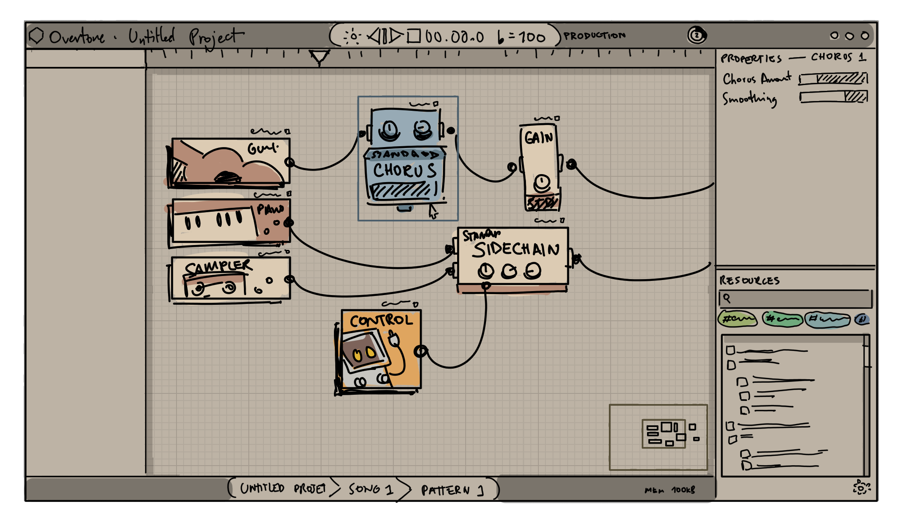

# Production Setups

A Production is an arrangement of _Nodes_ that pumps audio and data streams
from a Composition, transforms it with nodes and effects,
before pouring them into _Sinks_.

Productions are the most powerful aspect of Overtone, and yet are remarkably simple to understand.
You have signals, combine them into nodes, and then into an exporter or an output audio device.